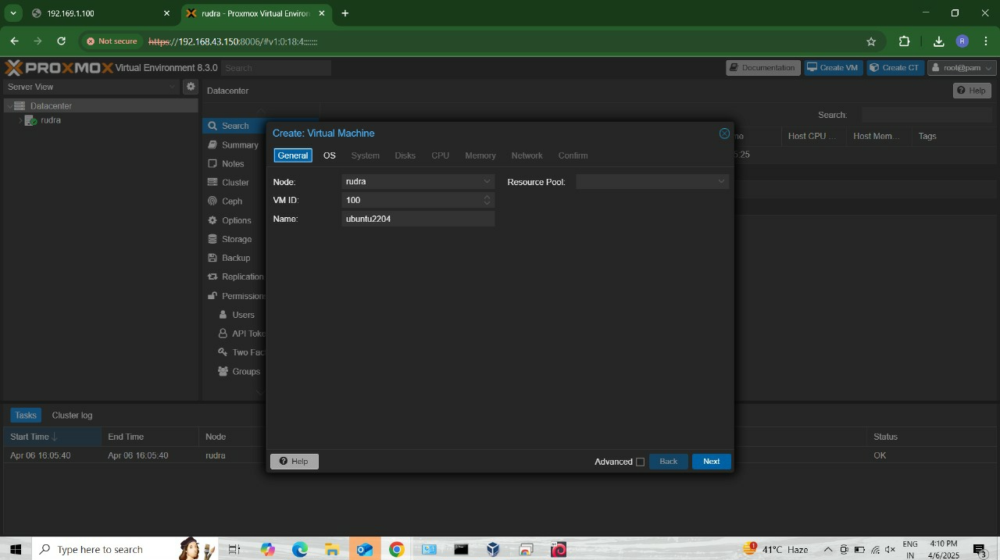

#  DevOps Internship Challenge 2025 – Rudra’s Submission

Hi! I’m **Rudra Pratap Singh Bhati**, a Computer Science student with a growing passion for DevOps and cloud automation.  
This repository documents my work and understanding developed during the **MediaAMP DevOps Internship Challenge 2025**.  
The goal was to simulate a real-world DevOps workflow—right from infrastructure automation to monitoring—with a hands-on approach.


__________________________________________________________________________________________


This project demonstrates a Flask web application deployed on a custom infrastructure manually set up using Proxmox VE, Docker, and Prometheus for monitoring.

## Infrastructure and Networking

- **Base Setup:** Proxmox VE installed on a VirtualBox VM.
- **Inside Proxmox:**
  - Ubuntu VM (Hosts Flask app and monitoring tools)
  - LXC Container (Used for additional testing)

## Flask Application Setup

1. Navigate to the `flask_app/` directory.
2. Install dependencies (if needed):
   ```bash
   pip install -r requirements.txt
   ```
3. Build and run the Docker container:
   ```bash
   docker build -t flask-app .
   docker run -d -p 5000:5000 flask-app
   ```
4. Create a SystemD service to ensure the Flask app starts on boot.

## Crontab Automation

1. Navigate to the `crontab/` directory.
2. Open crontab:
   ```bash
   crontab -e
   ```
3. Add the following line to run your script periodically:
   ```bash
   * * * * * /bin/bash /full/path/to/my-cron-script.sh
   ```

## Prometheus Monitoring Setup

1. Navigate to the `monitoring/` directory.
2. Start Prometheus and Node Exporter:
   ```bash
   docker-compose up -d
   ```
3. Access Prometheus UI:
   ```
   http://192.168.43.155:9090
   
   ```
 
## Jenkins CI/CD
Install on the same VM, accessed via: http://192.168.43.155:8080. A Jenkins pipeline automates Docker build and app deployment.

---
---


##  Tools & Technologies 
 


__________________________________________________________________________________________
---
##  Project Structure


---
---

##  Project Screenshots


---

---
.png>)
---

---

---

---

---


---

---

---


---
---

## Author

**Rudra Pratap Singh Bhati**  
_B.Tech CSE | DevOps Enthusiast | Passionate about Infrastructure & Automation_
 B.Tech Computer Science, 6th Sem
 
 DevOps Trainee (L&T EduTech)

🔗 LinkedIn : https://www.linkedin.com/in/rpsbhati123

📧E-Mail : rudra.22jics216@jietjodhpur.ac.in

---
---

